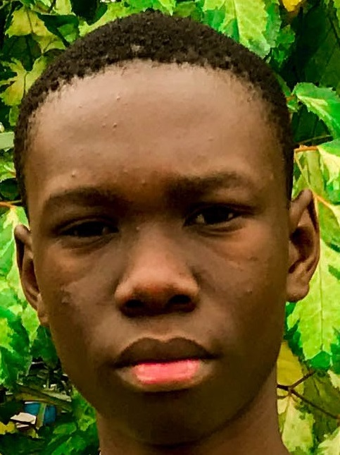

# Profile Card — ELIE

Une page profil statique et légère présentant une carte de visite numérique : photo, nom, liens vers les réseaux, boutons d'action et statistiques. Idéale comme page personnelle, signature ou composant visuel sur un site portfolio.



## Fonctionnalités
- Carte de profil responsive et centrée.
- Photo de profil + image de couverture décorative.
- Liens vers réseaux sociaux (Facebook, WhatsApp, Instagram, YouTube).
- Boutons d'action (Subscribe, Message).
- Section de statistiques (likes, messages, partages).
- Utilise Boxicons (CDN) et la police Poppins (Google Fonts).

## Technologies
- HTML
- CSS
- Boxicons (CDN)
- Google Fonts (Poppins)

## Aperçu du contenu du dépôt
```
index.html       # Page principale (structure HTML)
style.css        # Styles et layout de la carte
elie.jpg         # Image de profil
nbe.jpg / nbee.jpg # Images utilisées en background / décoration
verified_acc.png # Icône vérifié affichée près du nom
```

## Installation / Lancer localement
Aucune dépendance serveur : ouvrir `index.html` dans un navigateur suffit.

Exemples :
```bash
# cloner le dépôt
git clone https://github.com/ndombeelie/profile-elie.git
cd profile-elie

# ouvrir index.html directement (double-clic) ou lancer un petit serveur local
python -m http.server 8000
# puis ouvrir http://localhost:8000
```

## Personnalisation rapide
- Modifier le nom, le job et les liens : éditer `index.html` (éléments `.name`, `.job`, et les <a> dans `.media-buttons`).
- Changer l'image de profil : remplacer `elie.jpg` (ou mettre à jour `src`).
- Modifier l'image de couverture : remplacer `nbee.jpg` ou `nbe.jpg` (utilisées dans `style.css`).
- Couleurs / boutons : éditer `style.css` (classes `.profile-card`, `.buttons`, `.media-buttons`).

## Conseils d'amélioration
- Optimiser les images (webp / compression) pour réduire le poids et accélérer le chargement.
- Ajouter des attributs alt descriptifs pour les images pour l'accessibilité.
- Rendre les boutons accessibles au clavier (focus styles, aria-label si nécessaire).
- Transformer en composant réutilisable (React/Vue) si tu veux l'intégrer à une app plus grande.

## Contribution
Tu peux ouvrir une pull request ou me demander d'appliquer des modifications (ex : ajout d'un formulaire Contact, conversion en composant, optimisation d'images). Indique clairement les fichiers modifiés et l'objectif.

## Licence
Aucune licence fournie pour l'instant. Ajouter un fichier `LICENSE` (par ex. MIT) si tu souhaites partager librement le projet.

## Contact
Pour toute demande d'aide ou modification, contacte : elie (via les liens dans la carte) ou ouvre une issue sur ce dépôt.
